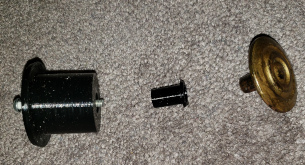
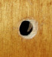
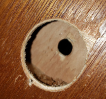
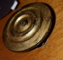

# HollowDoorKnobRepair  
  

  
An easy, parametric repair for hollow closet doors where the knob has been broken through.  
  
Just use a circular hole saw or drill bit to cut out the broken parts on the front and the back of the door. I make the smallest size hole on each side that will remove all the broken material. Then customize the parameters of this OpenSCAD file for the hole sizes.  
  
I had assumed that the wider diameter hole would be the one in back at the time I wrote this script. If the damage at the front of the door is wider than the damage at the back just swap the bolt head recess settings with the knob recess settings and you should be able to make a repair that fits. I may revisit this to automatically adjust for such a situation.  
  
   
 

